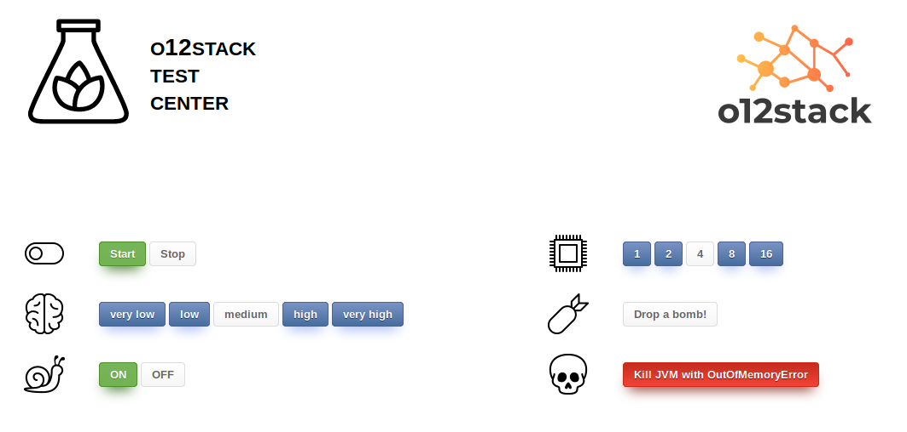

# O12Stack Test Center Application

This is a small demo application that can be used for test or training purposes regarding observability.

## What does this demo do?

This demo processes 'jobs' (small dummy tasks) using a thread pool with workers.

Once you started the application (a local demo is included, see "Run demo" at the end of this document), you can control the job flow via this UI, which you access via http://localhost:8080:



You can do the following things with the UI:

* start/stop the submission of jobs into the pipeline
* (brain symbol) select the job complexity which influces the average job duration
* (snail symbol) if switched on, about 3% of the jobs are outliers, their processing takes considerably longer
* (processor symbol) number of executors to adjust parallel execution
* (bomb symbol) If you drop a bomb (one per click), the next scheduled job will fail with an exception right after being launched.

## Metrics

The application offers Prometheus metrics via the endpoint http://localhost:8080/actuator/prometheus.

### Counters


This graph shows the total number of jobs over time. As it only shows counters, the values can only drop back to zero if the application is restarted.

|  metric/counter | description  | 
|---|---|---|---|---|
| `jobs_submitted_total`  | Total # of submitted jobs | 
| `jobs_completed_total`  | Total # of jobs that were completed successfully | 
| `jobs_failed_total`  | Total # of jobs that failed. | 

### Gauges


This graph shows the current number of jobs waiting to be executed.

|  metric/counter | description  | 
|---|---|---|---|---|
| `jobs_waiting`  | Current # of jobs which are waiting for execution | 
| `jobs_in_progress`  | Current # of jobs in progress (not shown in graph above) | 

### Summaries


These graphs show a summary of the job durations. The values are calculated as quantiles for a sliding window of 1m.

The orange graph between `10:57:30` and `11:00:30` shows that there were some outliers in that period.

The metric (produced by a 'timer' in Micrometer) `job_duration_timer_seconds` produces a variety of time series as shown here:

```
# HELP job_duration_timer_seconds  
# TYPE job_duration_timer_seconds summary
job_duration_timer_seconds{quantile="0.5",} 0.3145728
job_duration_timer_seconds{quantile="0.9",} 0.415236096
job_duration_timer_seconds{quantile="0.95",} 0.448790528
job_duration_timer_seconds{quantile="0.99",} 0.7340032
job_duration_timer_seconds_count 338.0
job_duration_timer_seconds_sum 105.783639
# HELP job_duration_timer_seconds_max  
# TYPE job_duration_timer_seconds_max gauge
job_duration_timer_seconds_max 0.871385
```

|  metric/counter | description  | 
|---|---|---|---|---|
| `job_duration_timer_seconds{quantile=...}`  | duration at given quantile (sliding window) | 
| `job_duration_timer_seconds_count`  | (Counter) number of counted durations (total) | 
| `job_duration_timer_seconds_sum`  | (Counter) sum of all counted durations (total) | 
| `job_duration_timer_seconds_max`  | (Gauge) max duration (sliding window) | 


These graphs show a summary of the job wait times. The values are also calculated as quantiles for a sliding window of 1m. The metric name is `job_wait_timer_seconds`. 

Showing a various number of different quantile values does not make so much sense in this case, as the waiting time is not as distributed as the duration (see above).

Therefore, we only show the mean, the 90% quantile and the max value. The average value (perhaps the most interesting one) is calculated from `job_wait_timer_seconds_sum` and `job_duration_timer_seconds_count`. As the latter values are counters, the average is not really comparable to the other values that are calculated on 1m sliding windows.


## Logs

(TBD)

## Usage / Demo

In our workshops, this application will be run inside a Kubernetes cluster. 
Within this repo, we provide a local demo based on `docker-compose`. The usage in Kubernetes can be easily (well, kind of ...) derived from this demo.

### Build application

Build the application including the Docker image:

    mvn clean package

### Run demo

The resources for this demo can be found in `./local-demo/`:

Spin up the stack with:

```
docker-compose up
```

The stack consists of the demo app, Prometheus and Grafana.

The UI of the demo app can be accessed via http://localhost:8080.

**Prometheus** is configured by mounting the `prometheus.yml` in which the scraping of our demo application is set up. You can access Prometheus via http://localhost:9090.

**Grafana** can be accessed via http://localhost:3000. The initial username/pwd is `admin`/`admin`, you are requested to change it, but that step can be skipped. 

The demo configures the datasource for Prometheus as well as an example dashboard (named **o12stack-test-center**) which displays some metrics of the test app.

Go play around with the stuff ...


[rules-of-a-threadpoolexecutor-pool-size]: http://www.bigsoft.co.uk/blog/2009/11/27/rules-of-a-threadpoolexecutor-pool-size
